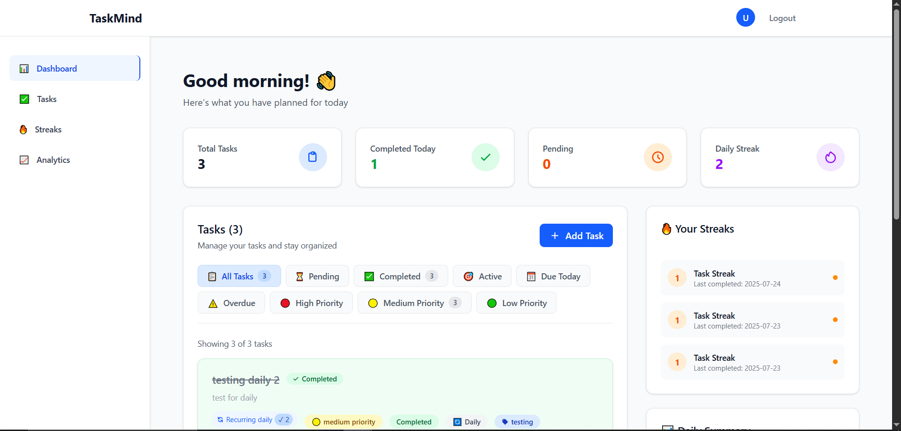
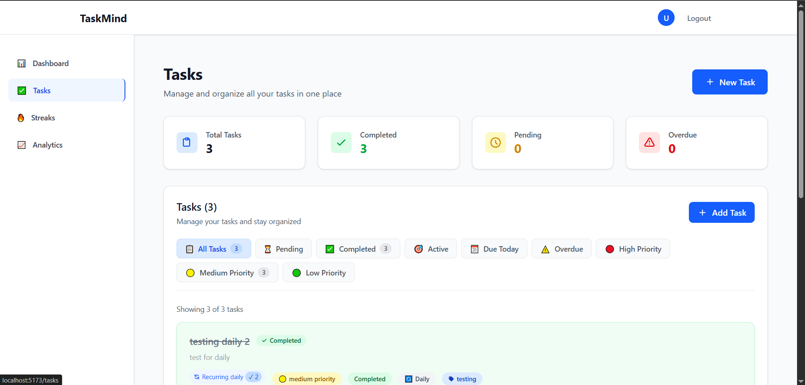
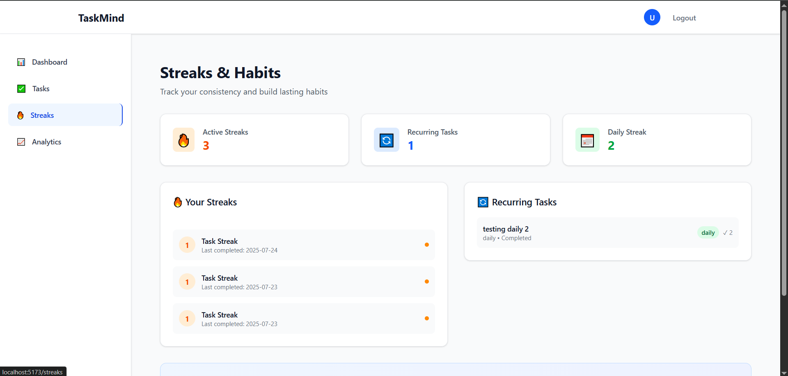
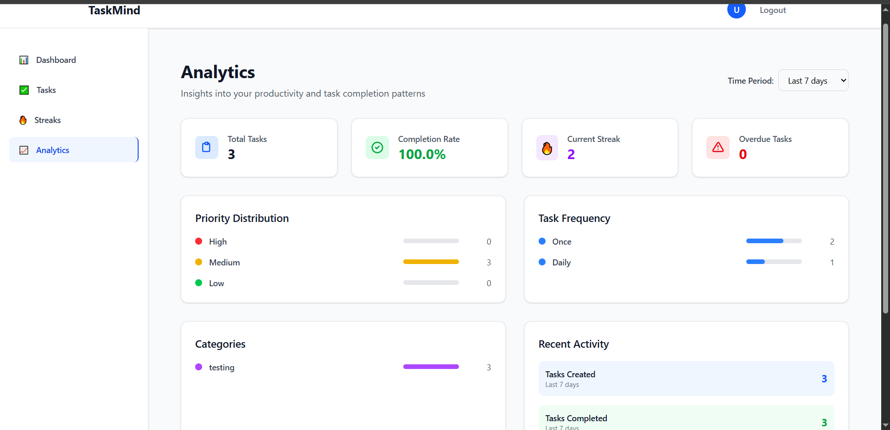

# 🧠 TaskMind - React Task Management Application

A comprehensive task management application built with **React**, **Node.js**, and **MongoDB** that helps users organize tasks, track streaks, and analyze productivity patterns.

---

## 🚀 Features

### Core Functionality

- ✅ **Task Management**: Create, edit, delete, and organize tasks with priorities, categories, and due dates  
- 🔁 **Recurring Tasks**: Support for daily, weekly, monthly, and yearly recurring tasks  
- 🔥 **Streak Tracking**: Monitor task completion streaks and build lasting habits  
- 📊 **Analytics Dashboard**: Comprehensive insights into productivity patterns and task completion rates  
- 🔐 **User Authentication**: Secure login/register system with JWT tokens  

### Advanced Features

- ♻️ **Smart Task Reset**: Recurring tasks automatically reset based on frequency  
- 🔄 **Real-time Updates**: Live updates across dashboard, tasks, and streaks  
- 🧩 **Data Consistency**: Cascading operations ensure related data stays synchronized  
- 📱 **Responsive Design**: Mobile-friendly interface with Tailwind CSS  
- 🌙 **Dark Mode Support**: Clean, modern UI with accessibility features  

---

## 🏗️ Project Structure

```
taskmind/
├── backend/
│   ├── controllers/
│   │   ├── taskController.js
│   │   ├── TaskStreakController.js
│   │   ├── UserDailySummaryController.js
│   │   └── authController.js
│   ├── models/
│   │   ├── Task.js
│   │   ├── TaskStreak.js
│   │   ├── UserDailySummary.js
│   │   └── User.js
│   ├── routes/
│   │   ├── taskRoutes.js
│   │   ├── taskStreakRoutes.js
│   │   ├── summaryRoutes.js
│   │   └── authRoutes.js
│   ├── middleware/
│   │   └── auth.js
│   └── server.js
├── frontend/
│   ├── src/
│   │   ├── components/
│   │   │   ├── auth/
│   │   │   ├── dashboard/
│   │   │   ├── tasks/
│   │   │   ├── layout/
│   │   │   └── common/
│   │   ├── pages/
│   │   ├── hooks/
│   │   ├── contexts/
│   │   ├── services/
│   │   └── App.jsx
│   └── package.json
└── README.md
```

---

## 🛠️ Tech Stack

### 🔧 Backend

- **Node.js**
- **Express.js**
- **MongoDB**
- **Mongoose**
- **JWT**
- **bcryptjs**
- **CORS**

### 🎨 Frontend

- **React 18**
- **React Router v6**
- **Tailwind CSS**
- **React Hooks**
- **Axios**
- **Context API**

---

## 📦 Installation

### ✅ Prerequisites

- Node.js (v16 or higher)
- MongoDB
- npm or yarn

### 🔧 Backend Setup

```bash
git clone https://github.com/yourusername/taskmind.git
cd taskmind/backend
npm install
```

Create a `.env` file:

```env
PORT=3000
MONGO_URI=mongodb://localhost:27017/taskmind
JWT_SECRET=your-super-secret-jwt-key
NODE_ENV=development
```

Start the backend:

```bash
npm start
# or for dev mode
npm run dev
```

### 🎨 Frontend Setup

```bash
cd ../frontend
npm install
npm run dev
```

Visit: http://localhost:5173

---

## 🔗 API Endpoints

### Authentication

```
POST /api/users/register
POST /api/users/login
GET  /api/users/profile
```

### Tasks

```
GET    /api/tasks
POST   /api/tasks
PUT    /api/tasks/:id
DELETE /api/tasks/:id
```

### Streaks

```
GET    /api/streaks
POST   /api/streaks/mark-complete
```

### Daily Summary

```
GET    /api/daily-summary/:date
POST   /api/daily-summary/log-summary
```

---

## 🎯 Key Features Deep Dive

### ✅ Task Management

- Priority Levels, Categories, Due Dates, Status Tracking, Frequency Options

### 🔁 Recurring Tasks

- Automatic Reset, Completion Tracking, Streak Maintenance, Smart Detection

### 📊 Analytics & Insights

- Completion Rates, Priority Distribution, Category Breakdown, Time Filtering, Trends

---

## 🔐 Authentication Flow

- Registration, Login (JWT), Protected Routes, Token Refresh, Logout

---

## 📊 Database Schema

### Task Model

```js
{
  userId: ObjectId,
  title: String,
  description: String,
  priority: ['low', 'medium', 'high'],
  category: String,
  frequency: ['once', 'daily', 'weekly', 'monthly', 'yearly'],
  dueDate: Date,
  isCompleted: Boolean,
  completedAt: Date,
  status: ['active', 'completed', 'paused', 'archived'],
  totalCompletions: Number,
  createdAt: Date,
  updatedAt: Date
}
```

### TaskStreak Model

```js
{
  userId: ObjectId,
  taskId: ObjectId,
  datesCompleted: [String],
  currentStreak: Number,
  longestStreak: Number,
  lastCompletedDate: String
}
```

### UserDailySummary Model

```js
{
  userId: ObjectId,
  date: String,
  tasksCompleted: Number,
  completedTaskIds: [ObjectId],
  streakCount: Number
}
```

---

## 🚀 Deployment

### Backend

```bash
npm run build
export NODE_ENV=production
export MONGO_URI=your-production-mongodb-uri
export JWT_SECRET=your-production-jwt-secret
npm start
```

### Frontend

```bash
npm run build
npm run preview
# Deploy /dist to hosting
```

---

## 📸 Screenshots

### Dashboard


### Tasks


### Streaks


### Analytics

